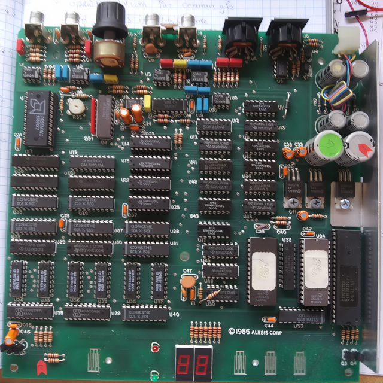

# MIDIVerb_RE

Reverse-engineering the MIDIVerb audio effects processor

## Background

In 1986 [Alesis](https://en.wikipedia.org/wiki/Alesis) released the [Midiverb](https://www.vintagedigital.com.au/alesis-midiverb/), a low-cost audio effects processor that provided affordable DSP-based reverberation effects that had previously only been available at high cost to musicians and recording engineers. The secret to its success was the amazing engineering effort by [Keith Barr](https://valhalladsp.com/2010/08/25/rip-keith-barr/), founder of Alesis who had invested years of effort in understanding the technology and optimizing it for the chips and processes available at that time. Since then the state of the art has advanced well beyond what was possible in the 1980s and algorithmic reverbs have improved in cost and capability to the point that they're almost an afterthought in many audio processing tools. Despite this, it's still worthwhile studying how the original MIDIVerb worked to get an understanding of exactly what's possible with minimal DSP technology and also to emulate those algorithms for that retro sound so many people remember fondly.

## Reverse Engineering

In the spring of 2021, my colleague Paul Schreiber borrowed several original MIDIVerb units and sent me one for analysis with the goal of creating an emulation for use in a product we were supporting. We opened them up and began to analyze the circuit board, tracing signals and studying the circuits. Paul started a schematic diagram in Diptrace and sent me the first page with the sections containing the Intel 8031 microcontroller circuits. He had a business to run so I took over the remaining task of completing the schematic which entailed many hours of continuity tests, reading TTL datasheets and puzzling over the underlying intent of the logic. Once I had the schematic completed and the flow of logic organized in a way that made sense, I started the task actually **understanding** how it worked. This mean not only knowing the circuit, but also the DSP microcode for the 63 algorithms and how to convert that into the high-level language I was using for the firmware in our product. After some trial and error I had a simple emulator written as a command-line application running under Linux which could process ordinary .WAV files through the MIDIVerb algorithms and the goal was achieved. As part of this effort I'd also created a "disassembler" for the microcode that was helpful in understanding the signal flow of the individual algorithms.

## Videos

I spent some time preparing a [slide deck](./docs/MV_Slides.pdf) that gave a high-level overview of the MIDIVerb design and Paul produced several Youtube videos in which he presented the slides with commentary. Those videos can be found here:

[Synthesis Technology Patreon preview: Alesis MidiVerb I (History) - YouTube](https://www.youtube.com/watch?v=2yYiWOHwHSo)

[Reverse-Engineering the Alesis MidiVerb I: Where to start? - YouTube](https://www.youtube.com/watch?v=z4cIt1VPAjU)

[Synthesis Technology: MidiVerb 1 schematic analysis - YouTube](https://www.youtube.com/watch?v=JNPpU08YZjk)

[Synthesis Technology: Reverse Engineering the Alesis MidiVerb 1: DSP Software - YouTube](https://www.youtube.com/watch?v=5DYbirWuBaU)

## Schematics

The schematics consist of the digital and analog/power sections and can be found in the [schematics](./schematics) directory where they are available both in Diptrace .dch format as well as a [PDF file](./schematics/MIDIVerb_Schematic.pdf) combining both.

## Code

The code that resulted from this reverse engineering effort falls into several categories:

#### ROMs

For copyright reasons, the EPROM dumps from the MIDIVerb and MIDIFex are not provided in this repository but may be found elsewhere. The source code assumes that the MIDIVerb dump is named "midifverb.bin" and the MIDIFex dump is named "midifex.bin".

#### Analysis

A "disassembler" named `parse_ucode.c` assists in analysis of the individual DSP algorithms. It removes pipeline offsets between instructions and address offsets and provides comments to help decipher the program flow. It also provides a list of buffer regions used by the algorithm.

#### Emulator

The core emulator code is contained in the file `midiverb.c` and needs to be provided with a pointer into an array containing the depipelined microcode. Depipelining and formatting is handled by `mk_mvucode.c` which is given the name of a binary file containing the microcode and generates a C header with the array definition. To test the emulator with a ROM dump binary from the command line the `sim_ucode.c` is provided, and to test with a prepared microcode header the `sim_midiverb.c` program is used. An additional utility vec_midiverb.c is provided that can be used to generate formatted test vectors for Verilog hardware implementations. All of these may be built using the included `Makefile`. 

#### Compiler

The MIDIVerb emulator discussed above is implemented as an interpreter that scans through a pre-formatted binary array of instructions and address offsets to execute the DSP algorithms. This has a fairly high execution cost and will easily swamp the resources of low-performance microcontrollers. To accelerate performance for low-spec processors it is necessary to "compile" the algorithms, reducing the overhead of array scanning and instruction interpretation. For this purpose I've created `mv_gencode.c` which converts MIDIVerb ROM dumps into optimized C code that can be further compiled to target microcontrollers. The C code result of this process can be tested with `sim_mvprogs.c` and compared to the emulator output with `tst_mvprogs.c` to check for execution errors. All these require an `mv_ucode.h` header file containing the pre-formatted array of microcode as described in the previous Emulator section.

## Verilog

A Verilog HDL (hardware description language) implementation of the MIDIVerb has been built and tested in several different FPGA platforms. Source code for that is provided in the `verilog` directory. Note that it relies on a ROM dump in Verilog hex format in the file `u51.hex`.

## SPICE

SPICE models of the MIDIVerb input and output analog filters are provided in the `spice` directory. 

## Newer Versions

After the original MIDIVerb there were other versions produced:

- MIDIFex - basically the same hardware as the MIDIVerb but with a different microcode EPROM containing additional effects. MIDIFex microcode will run correctly on MIDIVerb hardware and the emulator/compiler provided here.

- MIDIVerb II - similar DSP architecture but with much of the digital logic subsumed into a custom ASIC. The DSP microcode executes from a dual-port RAM allowing the 8031 MCU to alter the program in realtime to provide additional modulation opportunities. Some MIDIVerb II algorithms can be executed by the emulator & compiler here, but those which require intervention by the 8031 will not operate properly.

- MIDIVerb 3 & 4 - more advanced hardware that hasn't been examined further.

## Other Resources

Another command-line emulator can be found here: [MIDIVerb Emulator](https://github.com/thement/midiverb_emulator) which was independently developed based on information gleaned from Paul's Youtube videos.

 
